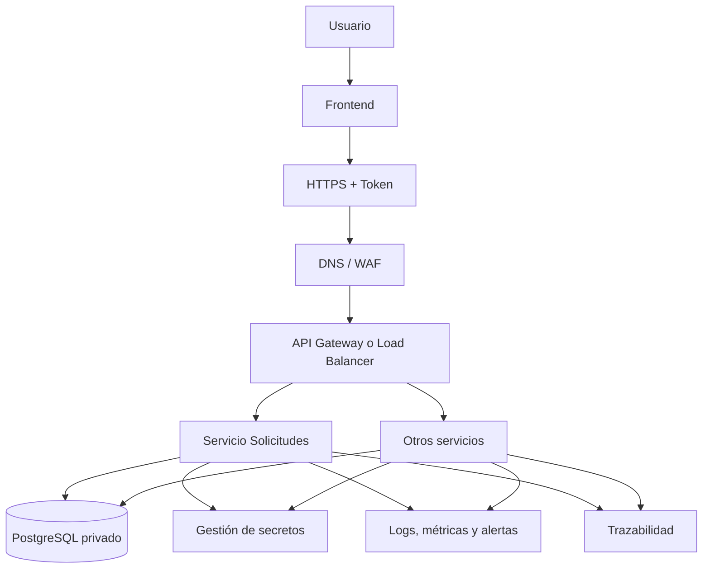

# Propuesta de implementación en AWS

## Objetivo
Proponer una arquitectura de despliegue en AWS para la solución, preservando el aislamiento de PostgreSQL y de los servicios internos frente a Internet, y manteniendo un punto de entrada controlado para el frontend y las APIs.

## Resumen ejecutivo
La arquitectura propuesta combina Amazon Cognito, CloudFront, WAF, un Application Load Balancer, ECS Fargate, ECR, RDS PostgreSQL, Secrets Manager, CloudWatch e IAM para construir una plataforma segura, escalable y operable. El diseño prioriza un acceso público controlado, autenticación centralizada mediante Cognito, segmentación de red privada para los servicios de negocio y trazabilidad integral para operación y auditoría.

## Servicios AWS propuestos
- **Route 53**: DNS público del frontend y del punto de entrada API.
- **CloudFront + WAF**: protección perimetral, caching del frontend y defensa frente a tráfico malicioso.
- **Amazon Cognito**: autenticación de usuarios del frontend, emisión y renovación de tokens, y gestión de sesiones.
- **Application Load Balancer**: punto de entrada HTTPS para los servicios backend.
- **ECS Fargate**: ejecución de contenedores backend y consumidor, sin administrar servidores.
- **ECR**: almacenamiento de imágenes Docker versionadas.
- **RDS PostgreSQL**: base de datos privada administrada con backups automáticos.
- **Secrets Manager**: secretos de base de datos, tokens y credenciales de servicios.
- **CloudWatch**: logs, métricas, alarmas y tableros.
- **IAM**: mínimo privilegio y permisos por servicio.

## Flujo de acceso
1. El usuario entra por el frontend.
2. El frontend redirige al usuario a Cognito para iniciar sesión.
3. Cognito emite tokens JWT y mantiene la sesión lógica mediante refresh tokens.
4. El frontend envía el access token por HTTPS hacia el API entry point.
5. WAF filtra tráfico y protege contra abusos.
6. ALB enruta por path o host hacia cada backend.
7. Los servicios backend validan firma, expiración y claims de los JWT en cada request.
8. Los servicios acceden a RDS PostgreSQL en subred privada.

## Segmentación de red
- Subred pública: ALB, NAT Gateway y componentes estrictamente necesarios.
- Subred privada: servicios backend, consumidor y PostgreSQL.
- Security Groups diferenciados por servicio.
- PostgreSQL nunca expuesto públicamente.

## Enrutamiento
- `/api/v1/solicitudes` hacia el servicio de solicitudes.
- Otros servicios por host o path según crezca el ecosistema.
- Health checks del ALB apuntando a `/health`.

## HTTPS y certificados
- Certificado gestionado por ACM.
- Listener 443 en ALB.
- Redirección opcional de 80 a 443.

## Cognito y sesiones
- Cognito User Pool como proveedor de identidad para el frontend.
- Tokens de acceso y de identidad firmados por Cognito.
- Refresh tokens para renovar sesión sin almacenar credenciales en el backend.
- Validación de JWKS en cada backend para verificar firma y claims.
- Los servicios backend no persisten sesiones; solo validan tokens presentados por el cliente.

## Autenticación y autorización
- El frontend obtiene token desde Cognito.
- Cada backend valida token y claims localmente o con middleware común.
- Comunicación servicio a servicio con IAM roles o tokens internos.

## CORS y protección adicional
- CORS limitado al dominio del frontend.
- Rate limiting en WAF o API Gateway si se adopta esa capa.
- Reglas anti-bot y bloqueo de IPs maliciosas.

## Secretos y trazabilidad
- Secrets Manager para passwords y tokens.
- CloudWatch Logs con formato estructurado JSON.
- Correlation ID propagado desde frontend hasta PostgreSQL cuando aplique.

## Escalabilidad y reversión
- ECS Service Auto Scaling por CPU, memoria o requests.
- Despliegue blue/green o rolling update.
- Reversión rápida por versión de imagen en ECR.

## Decisión sobre el punto de entrada
- ALB como entrada principal para los backends por simplicidad operativa y enrutamiento por path/host.
- API Gateway solo sería necesario si se requiere rate limiting más granular, cuotas por consumidor o exposición futura de APIs públicas con mayor control.
- Esta versión de la propuesta privilegia ALB + WAF + Cognito para mantener menos componentes sin perder seguridad.

## Flujograma

## Justificación
La propuesta preserva los principios de seguridad, separación de responsabilidades y mínimo privilegio exigidos por un entorno productivo. El backend y la base de datos permanecen fuera de exposición directa a Internet, la autenticación se centraliza en Cognito, el tráfico se enruta mediante un punto de entrada controlado y la observabilidad queda preparada para operar con trazabilidad, métricas y alertas. Con ello, la solución queda lista para evolucionar de forma ordenada hacia un ecosistema con frontend y múltiples servicios backend.
