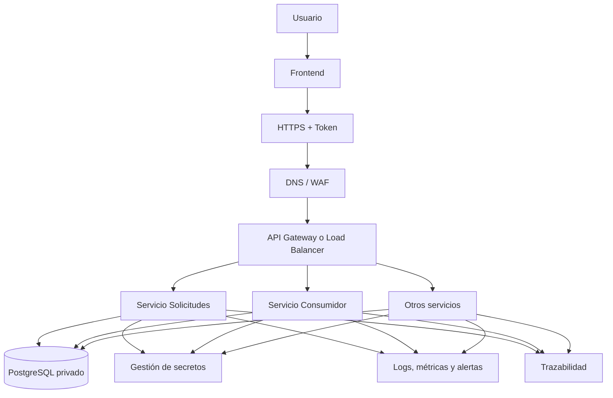

# Propuesta de implementación en AWS

## Objetivo
Proponer una arquitectura de despliegue en AWS para la solución, preservando el aislamiento de PostgreSQL y de los servicios internos frente a Internet, y manteniendo un punto de entrada controlado para el frontend y las APIs.

## Resumen ejecutivo
La arquitectura propuesta combina Amazon Cognito, CloudFront, WAF, un Application Load Balancer, ECS Fargate, ECR, RDS PostgreSQL, Secrets Manager, CloudWatch e IAM para construir una plataforma segura, escalable y operable. El diseño prioriza un acceso público controlado, autenticación centralizada mediante Cognito, segmentación de red privada para los servicios de negocio y trazabilidad integral para operación y auditoría.

## Servicios AWS propuestos
- **Route 53**: DNS público del frontend y del punto de entrada API.
- **CloudFront + WAF**: protección perimetral, caching del frontend y defensa frente a tráfico malicioso.
- **Amazon Cognito**: autenticación de usuarios del frontend, emisión y renovación de tokens, y gestión de sesiones.
- **Application Load Balancer**: punto de entrada HTTPS para los servicios backend.
- **ECS Fargate**: ejecución de contenedores backend y consumidor, sin administrar servidores.
- **Amazon EKS + HPA**: alternativa de orquestación para un ecosistema con más servicios y necesidad de escalado fino por carga.
- **ECR**: almacenamiento de imágenes Docker versionadas.
- **RDS PostgreSQL**: base de datos privada administrada con backups automáticos.
- **Secrets Manager**: secretos de base de datos, tokens y credenciales de servicios.
- **CloudWatch**: logs, métricas, alarmas y tableros.
- **IAM**: mínimo privilegio y permisos por servicio.

## Justificación por componente

### Route 53
**Qué resuelve:** proporciona un nombre estable para acceder al frontend y al punto de entrada de la API sin depender de direcciones IP.

**Cómo se configura:** se crean registros `A/AAAA` o `Alias` apuntando a CloudFront para el frontend y al ALB para la API, con TTL bajo si se prevén cambios frecuentes.

**Cómo se comunica:** el usuario resuelve el dominio mediante DNS y el tráfico sigue hacia CloudFront o al ALB según el subdominio o registro configurado.

### CloudFront + WAF
**Qué resuelve:** desacopla la entrega del frontend del backend, mejora latencia y añade una capa de protección frente a tráfico no deseado, bots y patrones maliciosos.

**Cómo se configura:** CloudFront se coloca delante del frontend o de la entrada pública, con WAF asociado al distribution. Se definen reglas administradas y reglas personalizadas por IP, país, tasa de peticiones o patrones de request.

**Cómo se comunica:** el navegador del usuario llega a CloudFront por HTTPS. CloudFront entrega contenido estático o reenvía tráfico al ALB cuando corresponde.

### Amazon Cognito
**Qué resuelve:** centraliza el login, evita manejar credenciales en el backend y permite que la sesión viva del lado de identidad, no en los servicios de negocio.

**Cómo se configura:** se crea un User Pool para autenticación de usuarios del frontend, con callback URLs, logout URLs, dominios autorizados y un app client con flujos de OAuth2/OpenID Connect. El frontend consume JWT y refresh tokens.

**Cómo se comunica:** el frontend redirige al login de Cognito, recibe los tokens y luego envía el access token en cada request al backend por HTTPS.

### Application Load Balancer
**Qué resuelve:** ofrece un único punto de entrada controlado para enrutar tráfico hacia múltiples servicios backend sin exponerlos públicamente.

**Cómo se configura:** se habilita listener 443 con certificado de ACM, redirección opcional 80->443 y target groups por servicio. El enrutamiento se hace por host o path.

**Cómo se comunica:** CloudFront o el navegador envían las requests al ALB; el ALB distribuye hacia el servicio correcto según la ruta.

### ECS Fargate
**Qué resuelve:** ejecuta los contenedores sin administrar servidores, lo que reduce operación y simplifica escalado.

**Cómo se configura:** cada backend y el consumidor se despliegan como servicios independientes con task definitions separadas, CPU/memoria ajustadas, health checks y security groups específicos.

**Cómo se comunica:** el ALB entrega requests al servicio correspondiente; los servicios, a su vez, consumen RDS y Secrets Manager mediante roles IAM y red privada.

### Amazon EKS + HPA
**Qué resuelve:** permite consolidar múltiples servicios con un control más fino del despliegue, el escalado y la separación de responsabilidades cuando el sistema crece.

**Cómo se configura:** se crea un cluster EKS en subredes privadas, con node groups o Karpenter para la capacidad de cómputo, manifests o Helm charts por servicio, Horizontal Pod Autoscaler por deployment y, si es necesario, Cluster Autoscaler para escalar nodos. Los ingress se integran con el ALB mediante AWS Load Balancer Controller.

**Cómo se comunica:** el ALB envía tráfico al Ingress Controller de Kubernetes, que lo enruta al service/pod correcto. El HPA aumenta o reduce réplicas de pods según CPU, memoria o métricas custom, mientras los pods siguen consumiendo RDS, Secrets Manager y CloudWatch por red privada.

**Cuándo conviene usarlo:** cuando la solución deja de ser solo un backend simple y pasa a tener más servicios, necesidades de autoscaling diferenciadas o equipos que prefieren un estándar de despliegue declarativo para múltiples workloads.

### ECR
**Qué resuelve:** almacena imágenes Docker versionadas y controladas, necesarias para despliegues reproducibles.

**Cómo se configura:** se crean repositorios por servicio, con políticas de lifecycle y push desde CI/CD.

**Cómo se comunica:** ECS descarga la imagen desde ECR al desplegar cada task.

### RDS PostgreSQL
**Qué resuelve:** provee persistencia transaccional administrada con backups, mantenimiento y alta disponibilidad sin exponer la base a Internet.

**Cómo se configura:** se despliega en subred privada, con security group que solo permita acceso desde los servicios backend. Las credenciales no se incrustan en la imagen; se consumen desde Secrets Manager.

**Cómo se comunica:** los servicios backend consultan la base por red privada usando el endpoint interno de RDS.

### Secrets Manager
**Qué resuelve:** evita almacenar secretos en código, Dockerfile o variables planas expuestas en repositorio.

**Cómo se configura:** se guarda allí el password de PostgreSQL, tokens internos y credenciales sensibles. ECS obtiene acceso mediante IAM role de task.

**Cómo se comunica:** el backend lee el secreto al arrancar o en runtime, sin exponerlo al usuario final.

### CloudWatch
**Qué resuelve:** centraliza observabilidad, trazabilidad operativa y alertas.

**Cómo se configura:** los contenedores escriben logs estructurados JSON, CloudWatch Logs los centraliza y se crean métricas/alarms sobre errores, latencia y volumen.

**Cómo se comunica:** backend y consumer envían logs con correlation ID, endpoint, status y elapsed time; CloudWatch los agrupa y permite consulta y alarmas.

### IAM
**Qué resuelve:** aplica mínimo privilegio y evita que un servicio tenga acceso más amplio del necesario.

**Cómo se configura:** se definen roles separados para ECS tasks, acceso a Secrets Manager, lectura de ECR y publicación de logs. Cada rol solo tiene permisos para su función.

**Cómo se comunica:** los servicios asumen roles al ejecutarse y usan esas credenciales temporales para acceder a AWS sin credenciales embebidas.

## Flujo de acceso
1. El usuario entra por el frontend.
2. El frontend redirige al usuario a Cognito para iniciar sesión.
3. Cognito emite tokens JWT y mantiene la sesión lógica mediante refresh tokens.
4. El frontend envía el access token por HTTPS hacia el API entry point.
5. WAF filtra tráfico y protege contra abusos.
6. ALB enruta por path o host hacia cada backend.
7. Los servicios backend validan firma, expiración y claims de los JWT en cada request.
8. Los servicios acceden a RDS PostgreSQL en subred privada.
9. Los secretos se consumen desde Secrets Manager.
10. Los logs y métricas se centralizan en CloudWatch con trazabilidad por solicitud.

## Segmentación de red
- Subred pública: ALB, NAT Gateway y componentes estrictamente necesarios.
- Subred privada: servicios backend, consumidor y PostgreSQL.
- Security Groups diferenciados por servicio.
- PostgreSQL nunca expuesto públicamente.

## Enrutamiento
- `/api/v1/solicitudes` hacia el servicio de solicitudes.
- Otros servicios por host o path según crezca el ecosistema.
- Health checks del ALB apuntando a `/health`.

## HTTPS y certificados
- Certificado gestionado por ACM.
- Listener 443 en ALB.
- Redirección opcional de 80 a 443.

## Cognito y sesiones
- Cognito User Pool como proveedor de identidad para el frontend.
- Tokens de acceso y de identidad firmados por Cognito.
- Refresh tokens para renovar sesión sin almacenar credenciales en el backend.
- Validación de JWKS en cada backend para verificar firma y claims.
- Los servicios backend no persisten sesiones; solo validan tokens presentados por el cliente.

## Autenticación y autorización
- El frontend obtiene token desde Cognito.
- Cada backend valida token y claims localmente o con middleware común.
- Comunicación servicio a servicio con IAM roles o tokens internos.

## CORS y protección adicional
- CORS limitado al dominio del frontend.
- Rate limiting en WAF o API Gateway si se adopta esa capa.
- Reglas anti-bot y bloqueo de IPs maliciosas.

## Secretos y trazabilidad
- Secrets Manager para passwords y tokens.
- CloudWatch Logs con formato estructurado JSON.
- Correlation ID propagado desde frontend hasta PostgreSQL cuando aplique.

## Escalabilidad y reversión
- ECS Service Auto Scaling por CPU, memoria o requests.
- Despliegue blue/green o rolling update.
- Reversión rápida por versión de imagen en ECR.
- Si se adopta EKS, el escalado de pods se gestiona con HPA y el de capacidad de cómputo con Cluster Autoscaler o Karpenter.

## Decisión sobre el punto de entrada
- ALB como entrada principal para los backends por simplicidad operativa y enrutamiento por path/host.
- API Gateway solo sería necesario si se requiere rate limiting más granular, cuotas por consumidor o exposición futura de APIs públicas con mayor control.
- Esta versión de la propuesta privilegia ALB + WAF + Cognito para mantener menos componentes sin perder seguridad.

## Restricciones de arquitectura
- El backend y PostgreSQL no se exponen directamente a Internet.
- El acceso público se realiza mediante un punto de entrada controlado y por HTTPS.
- PostgreSQL permanece en subred privada.
- Cada servicio backend valida autorización en cada request.
- Las credenciales viven en Secrets Manager y en variables de entorno inyectadas en tiempo de ejecución; no se almacenan en código ni en imágenes Docker.
- Cada servicio aplica mínimo privilegio mediante IAM y security groups específicos.
- La arquitectura permite incorporar nuevos servicios por host o path sin rediseñar el perímetro.
- Los logs se centralizan en CloudWatch y las solicitudes se trazan con correlation ID en backend, consumer y base de datos cuando aplique.

## Flujograma

## Justificación
La propuesta preserva los principios de seguridad, separación de responsabilidades y mínimo privilegio exigidos por un entorno productivo. El backend y la base de datos permanecen fuera de exposición directa a Internet, la autenticación se centraliza en Cognito, el tráfico se enruta mediante un punto de entrada controlado y la observabilidad queda preparada para operar con trazabilidad, métricas y alertas. Para la primera etapa, ECS Fargate simplifica la operación; si el ecosistema crece y se requiere mayor granularidad en el escalado y en la coordinación de muchos servicios, EKS con HPA ofrece un camino natural de evolución. Con ello, la solución queda lista para crecer de forma ordenada hacia un entorno con frontend y múltiples servicios backend.
